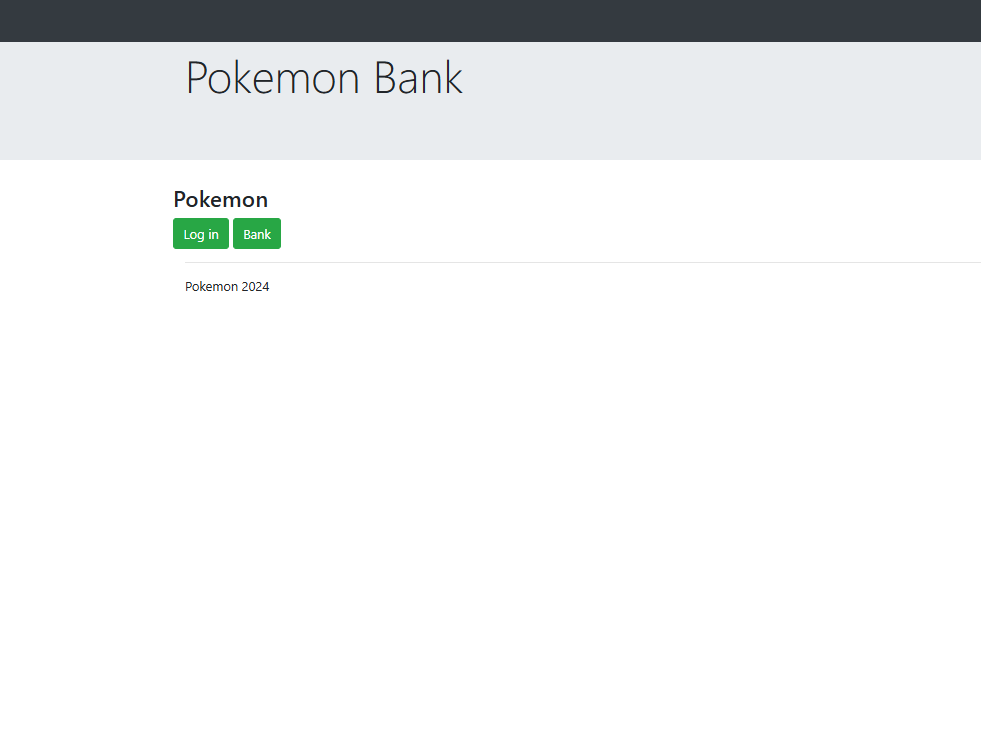
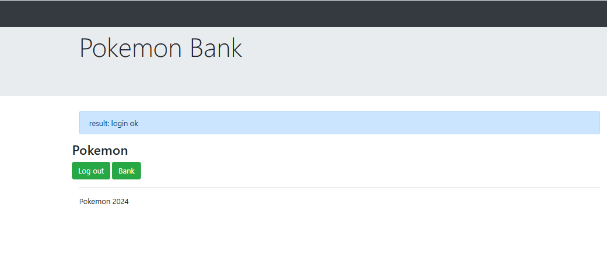
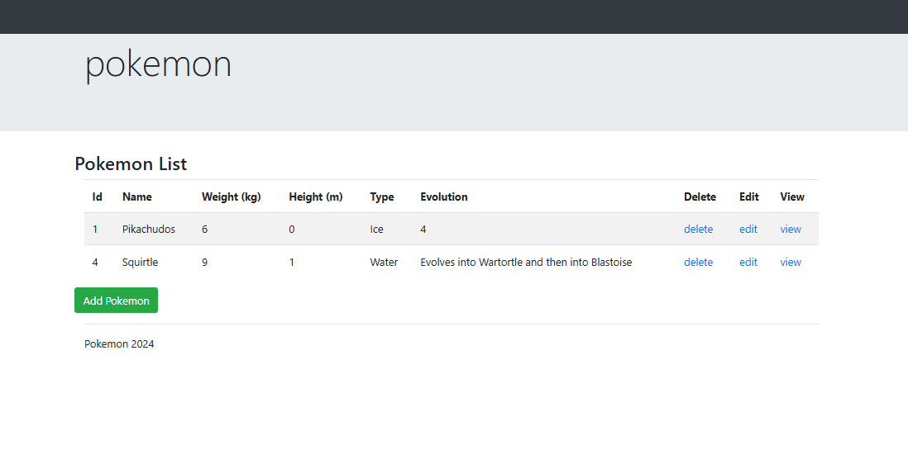
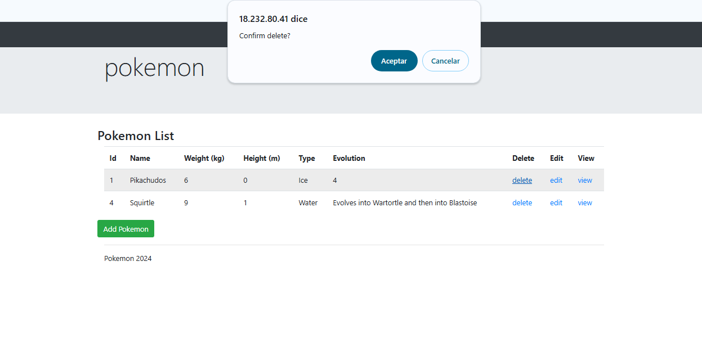
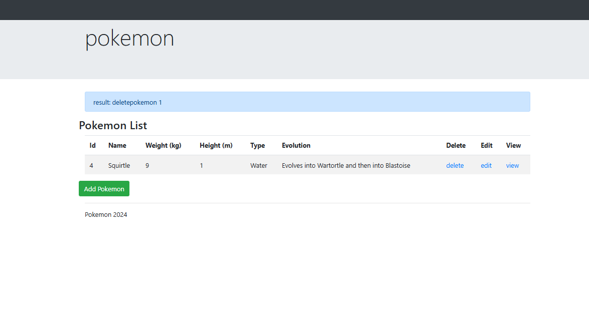
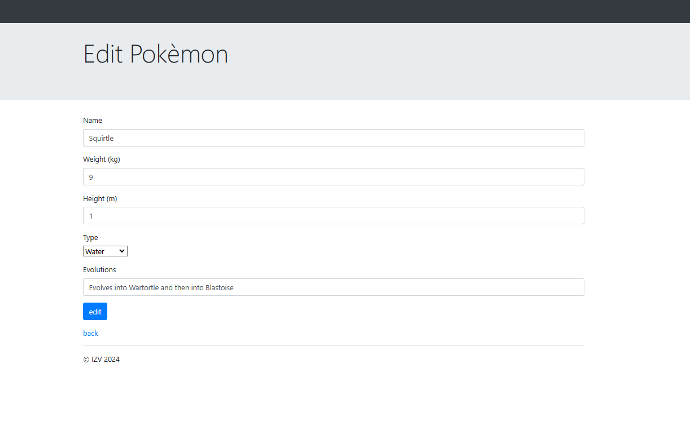
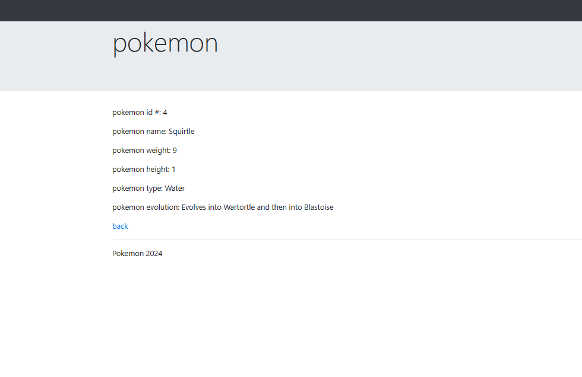

# Banco Pokémon - CRUD en Laravel

Este proyecto consiste en una aplicación básica de CRUD utilizando Laravel para gestionar una base de datos de Pokémon. Los usuarios pueden agregar, editar, eliminar y consultar información sobre los Pokémon.

## 1. Estructura del Proyecto

### Creación del Proyecto

Primero, crea el proyecto de Laravel en el directorio deseado:

```bash
cd /var/www/html/laraveles/
sudo composer create-project laravel/laravel bancoPokemon
cd bancoPokemon/
Dale los permisos necesarios a tu directorio para evitar problemas al trabajar con los archivos:


sudo chown -R ubuntu:www-data /var/www/html/laraveles/
sudo chmod -R 775 /var/www/html/laraveles/
Si estás utilizando un repositorio clonado previamente, asegúrate de tenerlo en el directorio:


cd /var/www/html/laraveles/
git clone https://github.com/dwesizv/traditionalLaravelApp.git
cd bancoPokemon/
Instala las dependencias del proyecto:


composer install
php artisan key:generate
Configuración de la Base de Datos
Edita el archivo .env para configurar la conexión a la base de datos:


DB_CONNECTION=mysql
DB_HOST=127.0.0.1
DB_PORT=3306
DB_DATABASE=nombreBaseDatos
DB_USERNAME=usuario
DB_PASSWORD=contraseña
```
Luego, ejecuta las migraciones:

```bash
php artisan migrate
```
Copia la carpeta assets al directorio public y crea las vistas necesarias dentro de resources/views (las carpetas pokeball y main).

## 2.  Controladores

MainController.php

Crea un controlador para manejar el login, logout y la vista principal:
```bash
<?php

namespace App\Http\Controllers;

use Illuminate\Http\Request;

class MainController extends Controller
{
    public function login(Request $request)
    {
        $request->session()->flash('message', 'User logged in');
        $request->session()->put('user', true);
        return redirect()->back();
    }

    public function logout(Request $request)
    {
        $request->session()->flash('message', 'User logged out');
        $request->session()->forget('user');
        return redirect()->back();
    }

    public function main()
    {
        return view('main.main', ['activeHome' => 'active']);
    }
}
```
PokemonController.php

Crea un controlador para manejar las operaciones CRUD de los Pokémon:

```bash
<?php
namespace App\Http\Controllers;

use App\Models\Pokemon;
use Illuminate\Http\Request;

class PokemonController extends Controller
{
    public function index()
    {
        $pokemons = Pokemon::all();
        return view('pokeball.index', compact('pokemons'));
    }

    public function create()
    {
        return view('pokeball.create');
    }

    public function store(Request $request)
    {
        Pokemon::create($request->all());
        return redirect()->route('pokemon.index');
    }

    public function show(Pokemon $pokemon)
    {
        return view('pokeball.show', compact('pokemon'));
    }

    public function edit(Pokemon $pokemon)
    {
        return view('pokeball.edit', compact('pokemon'));
    }

    public function update(Request $request, Pokemon $pokemon)
    {
        $pokemon->update($request->all());
        return redirect()->route('pokemon.index');
    }

    public function destroy(Pokemon $pokemon)
    {
        $pokemon->delete();
        return redirect()->route('pokemon.index');
    }
}

```
## 3.  Rutas (web.php)
Define las rutas necesarias en routes/web.php:
```bash
<?php

use App\Http\Controllers\MainController;
use App\Http\Controllers\PokemonController;
use Illuminate\Support\Facades\Route;

Route::get('/', [MainController::class, 'main'])->name('main');
Route::get('login', [MainController::class, 'login'])->name('login');
Route::get('logout', [MainController::class, 'logout'])->name('logout');
Route::resource('pokemon', PokemonController::class);

```
Si es necesario, habilita el módulo de reescritura de Apache y reinicia el servicio:

```bash
sudo nano /etc/apache2/apache2.conf

# <Directory /var/www/>
# AllowOverride All

sudo a2enmod rewrite
sudo service apache2 restart
```

## 4.  Vistas

main.blade.php

La vista principal que ofrece las opciones de login/logout y acceso al banco de Pokémon:

```bash
@extends('base')

@section('title', 'Banco Pokémon')

@section('content')
    @if(session('user'))
        <a href="{{ url('logout') }}" class="btn btn-primary">Logout</a>
    @else
        <a href="{{ url('login') }}" class="btn btn-primary">Login</a>
    @endif
    &nbsp;
    <a href="{{ url('pokemon') }}" class="btn btn-primary">Banco de Pokémon</a>
@endsection
```
index.blade.php
Vista para mostrar la lista de Pokémon y las opciones de edición y eliminación:
```bash

@extends('base')

@section('title', 'Listado de Pokémon')

@section('content')
    <h1>Lista de Pokémon</h1>
    <a href="{{ route('pokemon.create') }}" class="btn btn-success">Agregar Nuevo Pokémon</a>
    <table id="pokemonTable" class="table mt-3">
        <thead>
            <tr>
                <th>Nombre</th>
                <th>Tipo</th>
                <th>Acciones</th>
            </tr>
        </thead>
        <tbody>
            @foreach($pokemons as $pokemon)
                <tr>
                    <td>{{ $pokemon->name }}</td>
                    <td>{{ $pokemon->type }}</td>
                    <td>
                        <a href="{{ route('pokemon.edit', $pokemon) }}" class="btn btn-warning">Editar</a>
                        <a href="{{ route('pokemon.show', $pokemon) }}" class="btn btn-info">Ver</a>
                        <a href="#" class="btn btn-danger delete-link" data-url="{{ route('pokemon.destroy', $pokemon) }}">Eliminar</a>
                    </td>
                </tr>
            @endforeach
        </tbody>
    </table>

    <form id="deleteForm" method="POST" style="display: none;">
        @method('DELETE')
        @csrf
    </form>
@endsection

```
## 5.  Script JavaScript
En public/assets/js/script.js, agrega el siguiente código para manejar la confirmación de eliminación mediante JavaScript:

```bash
(function () {

    let table = document.getElementById('pokemonTable');

    if (table) {
        table.addEventListener('click', handleTableClick);
    }

    function handleTableClick(event) {
        const deleteForm = document.getElementById('deleteForm');
        let target = event.target;
        if (target.tagName === 'A' && target.classList.contains('delete-link')) {
            event.preventDefault();
            if (confirm('¿Estás seguro de que quieres eliminar este Pokémon?')) {
                let url = target.dataset.url;
                deleteForm.action = url;
                deleteForm.submit();
            }
        }
    }

})();
```
## 6.  Ajustes de Seguridad en Apache
Asegúrate de que AllowOverride All esté habilitado en el archivo de configuración de Apache (/etc/apache2/apache2.conf) para permitir que .htaccess funcione correctamente:

```bash
sudo nano /etc/apache2/apache2.conf
# <Directory /var/www/>
# AllowOverride All
```

Luego, reinicia Apache para aplicar los cambios:
```bash
sudo service apache2 restart
```
Este proyecto proporciona una estructura básica para una aplicación de CRUD de Pokémon utilizando Laravel, permitiendo realizar todas las operaciones CRUD (Crear, Leer, Actualizar, Eliminar) sobre los Pokémon.


## Captura







